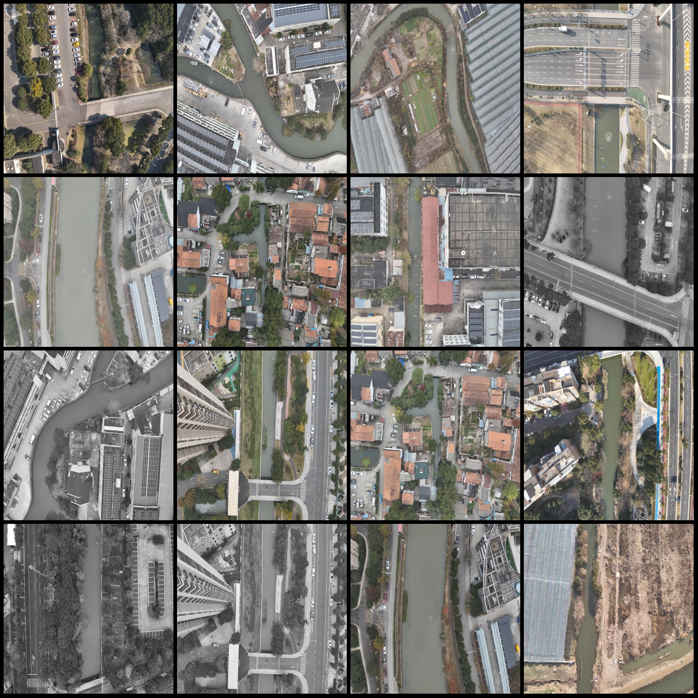
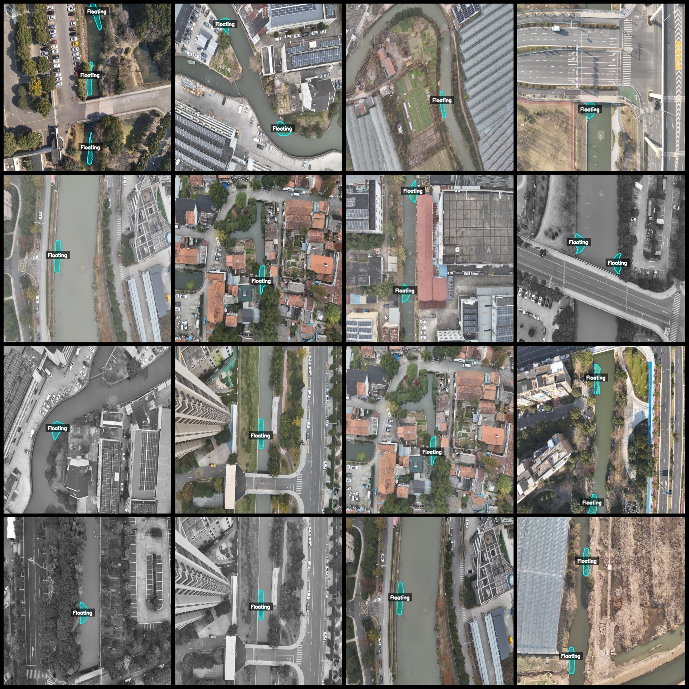
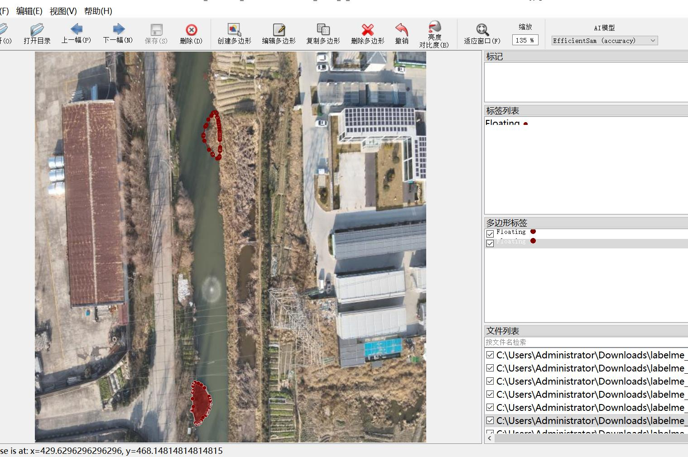

# Drone-Viewpoint Aerial Photography Floating Object and Waste Sorting Dataset (labelme format) - 256 images per category

Dataset format: labelme format (excluding mask files, only including jpg images and corresponding json files)
Number of image files: 256
Number of annotations: 256
Number of categories: 1
Annotation category name: "Floating"
Number of bounding box counts for each category: 387
Total bounding box count: 387
Annotation tool used: labelme version 5.5.0
Repository location: firc-dataset
Image resolution: 640x640
Drone model used: DJI M350rtk
Collection height: 300m
Collection angle: 90°
Dataset has enhancements: about 99 out of the original images are in their original state, with the remaining being enhanced images.
Annotation rules: Polygons are drawn around the classes.
Important notes: The dataset can be edited in labelme, and the json dataset needs to be converted into mask or yolo format or coco format for semantic segmentation or instance segmentation.
Special declaration: This dataset does not guarantee the accuracy of the trained models or weight files.
Image previews:
Annotation example:
Original image:
Annotation drawing result:
Labelme editing example:

## Image

Here is a pay link on Stripe ( https://buy.stripe.com/3cs8yP7sY87d0vu9AB ). Please contact me lonlonago@foxmail.com after funding $89, and I will send you a complete data files , thank you!

